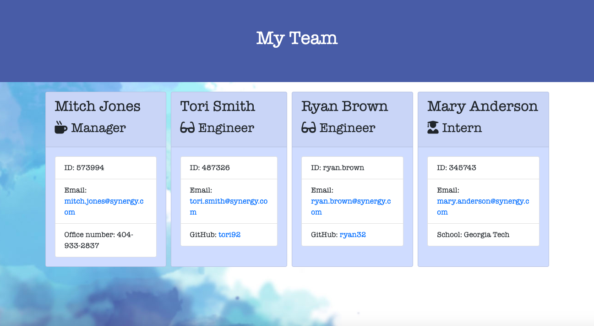

# employee-summary-template

  

  ## The Repository
  Link to repository: https://github.com/awebb8/employee-summary-template

  ## About
  The Employee Summary Template is a command line application.  It takes in information about employees on a software engineering team and generates an HTML webpage that displays summaries for each person. The user can input any number of team members, and they may be a mix of engineers and interns. When the user has completed building the team, the application will create an HTML file that displays a nicely formatted team roster based on the information provided by the user.

  

  ## Table of Contents
  * [Installation](#installation)
  * [Usage](#usage)
  * [License](#License)
  * [Credits](#Credits)
  * [Tests](#Tests)

  ## Installation
  Clone the employee-summary-template repository from GitHub.  Then utilize "npm install" to install Inquirer and Jest. For more information on installing and using Inquirer, visit https://www.npmjs.com/package/inquirer#installation.  For more information on installing and using Jest, visit https://jestjs.io/.

  ## Usage
  The Employee Summary Template runs as a Node CLI to gather information about each employee of a software engineering team that consists of a manager, and any number of engineers and interns. After following installation instructions, run "node app.js" in your terminal.  Then answer all the questions that you're prompted with about the manager of the software engineering team.  After all manager questions have been answered, the user is prompted to select an employee to add to the team, either an engineer or intern.  After the user adds a new employee, they are prompted again to select another employee to add.  The user may also choose to stop adding to the team at any point.  A team.html file is then created in the output directory.  When team.html is opened in the browser, employee information is displayed in bootstrap cards.  This can be used as a nicely formatted team roster to display the employees' names, roles, ids, and any role-specific properties (school for interns, github profile for engineers, and office number for managers).
  Inquirer is used to prompt the user for their email, id, and specific information based on their role with the company. For instance, an intern may provide their school, whereas an engineer may provide their GitHub username.

  ## License
  This project is licensed under the terms of the MIT License.

  ## Credits
  The background image in output/style.css is provided by pngtree.com, https://pngtree.com/free-backgrounds.

  ## Tests
  Unit tests can be found in the test directory in the repository.  To run tests, type "npm run test" in the terminal and hit enter.
